<div align="center">

# omamac

**[Omarchy](https://omarchy.org) Quattro's theming, on macOS.**

One keystroke restyles your terminal, editor, pager, window manager, system
appearance and wallpaper together — from a single theme definition.

[](#requirements)
[](#the-themes)
[](#credits)
[](#development)
[](LICENSE)

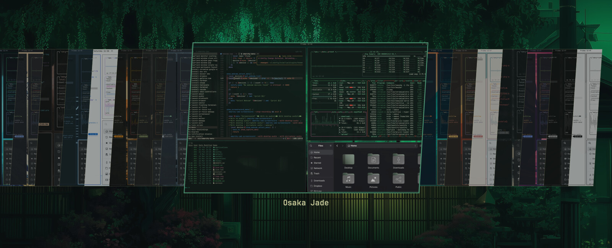

<sub><kbd>⌘</kbd><kbd>⌥</kbd><kbd>O</kbd> → <b>Theme</b>. Pick one and everything
re-renders at once — Ghostty and Claude Code retint without a restart.</sub>

</div>

---

Omarchy is a Linux desktop, and its theming reaches into Hyprland, GTK,
Quickshell and friends. omamac ports the parts that make sense on a Mac,
**copying Omarchy's real values rather than approximating them** — the menu's
geometry, the picker's coverflow, the thumbnail recipe and the colour mappings
are all lifted from the upstream QML and shell sources at a pinned release tag.

**Contents** — [The menu](#the-menu) · [What it themes](#what-it-themes) ·
[Install](#install) · [Wiring individual tools](#wiring-individual-tools) ·
[Usage](#usage) · [omamac doctor](#omamac-doctor) ·
[Configuration](#configuration) · [How it works](#how-it-works) ·
[Development](#development)

## The menu

Six things at the root. Type to filter, arrows to move, <kbd>Enter</kbd> to
apply, <kbd>Esc</kbd> to go back one level and then close.

<div align="center">
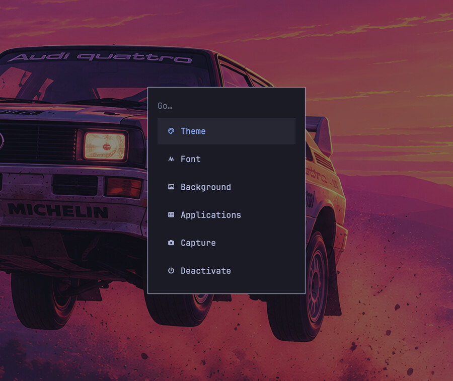
</div>

### Theme and Background

Both are coverflows, exactly like Omarchy's image picker: the centre card at
full size, its neighbours skewed away behind it. Theme previews and wallpapers
are fetched from a pinned upstream tag and cached, then thumbnailed with the
same recipe Omarchy uses — 1536×864, smart-cropped, quality 82.

<table>
<tr>
<td width="50%"></td>
<td width="50%">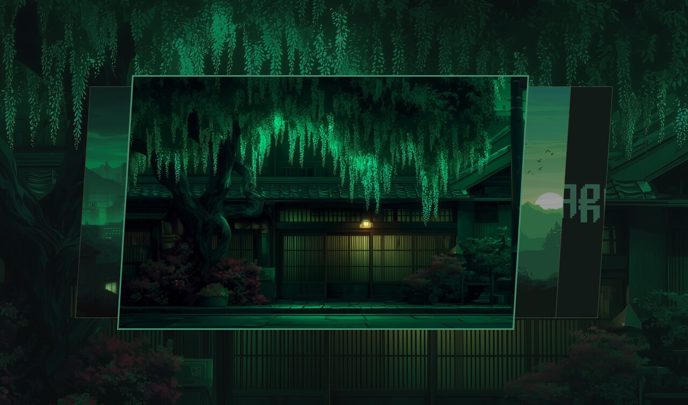</td>
</tr>
<tr>
<td align="center"><sub><b>Theme</b> — 22 of them, the current one ticked</sub></td>
<td align="center"><sub><b>Background</b> — the current theme's wallpapers</sub></td>
</tr>
</table>

### Font

Restricted to Nerd Fonts, because every source omamac reads already reports only
monospace families — so "monospace" would narrow nothing, while the Nerd Font
filter keeps out the CJK system faces that are fixed-width but useless for code.
The list folds mid-row rather than showing a scrollbar, which is how you can
tell there's more below.

<div align="center">
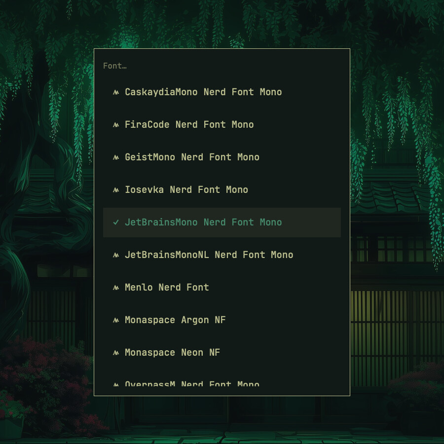
</div>

### Applications

**Applications** holds what belongs to one specific app. The root keeps what
does not — the theme, the wallpaper, and the monospace font *family*, which is a
system-wide choice any app added later shares rather than picking its own.

<table>
<tr>
<td width="33%">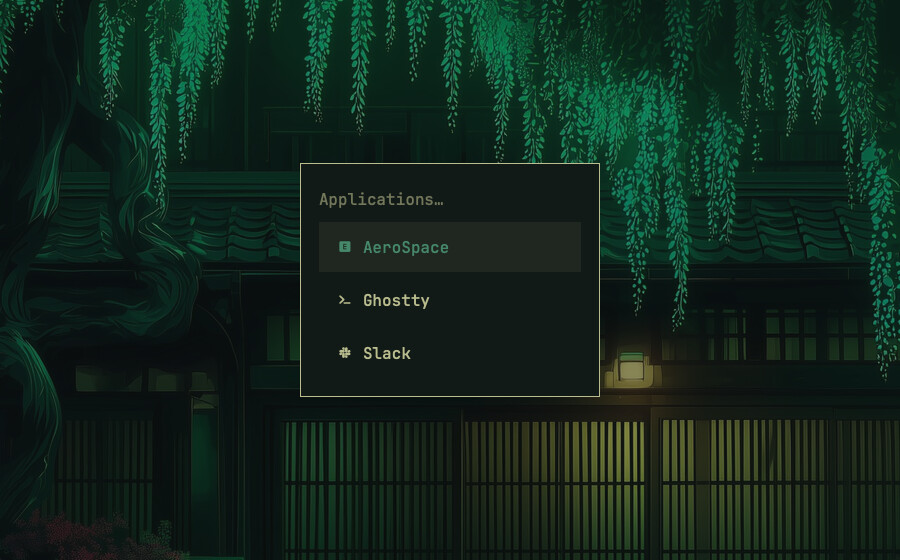</td>
<td width="33%">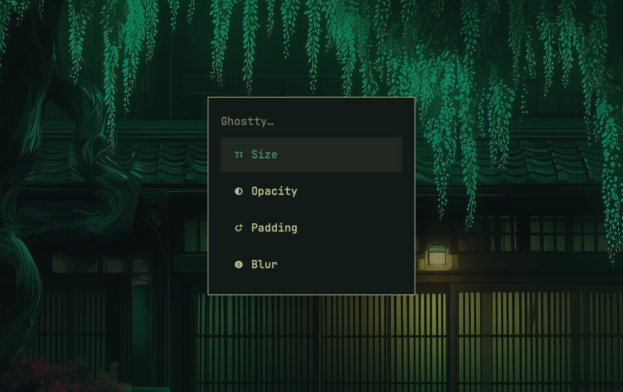</td>
<td width="33%">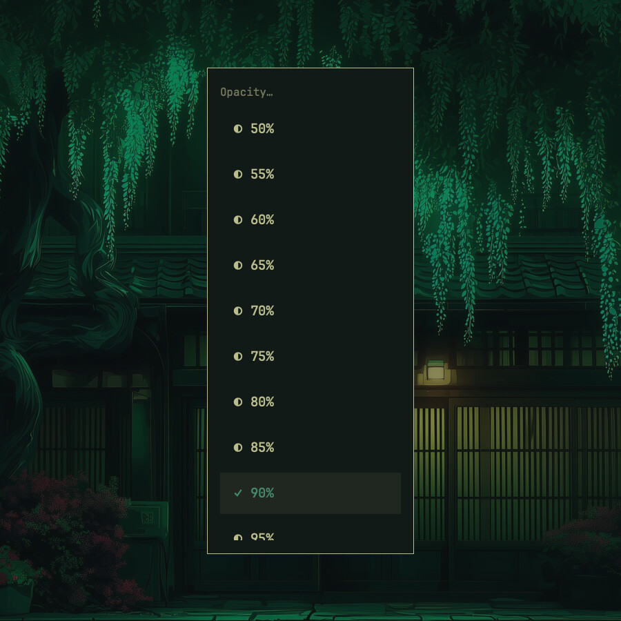</td>
</tr>
<tr>
<td align="center"><sub>Three apps so far</sub></td>
<td align="center"><sub><b>Ghostty</b> — four settings</sub></td>
<td align="center"><sub><b>Opacity</b> — 50–100%</sub></td>
</tr>
</table>

Ghostty's four are preferences rather than theme properties, so they survive a
theme switch. **Opacity** makes the terminal background translucent; **Blur**
softens what shows through, and only does anything below full opacity;
**Padding** is the space inside the window, the counterpart to AeroSpace's gaps
between windows — the two are usually worth tuning together. **Size** is the
font size, which is per-app in a way the family isn't.

### AeroSpace

Gaps, and which monitor each workspace is pinned to. Both apply live via
`aerospace reload-config`, validated with `--dry-run` first so a config AeroSpace
would reject is never adopted.

<table>
<tr>
<td width="33%">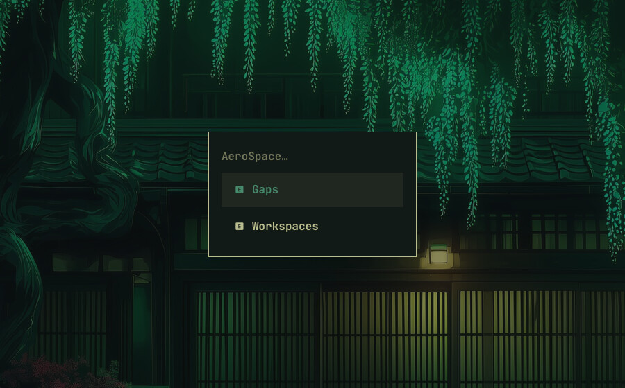</td>
<td width="33%">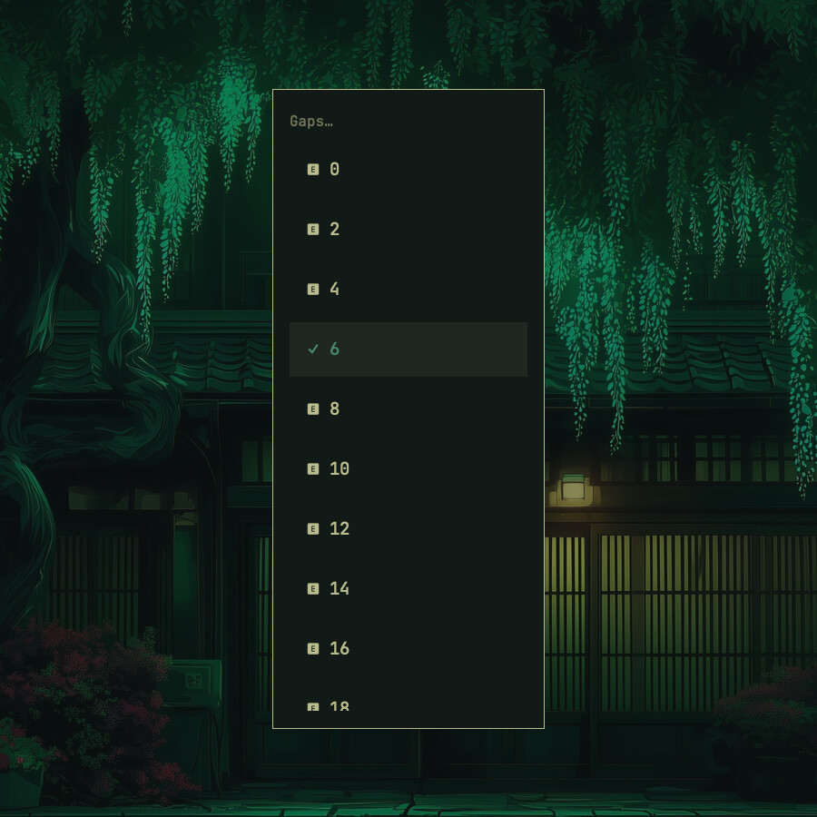</td>
<td width="33%">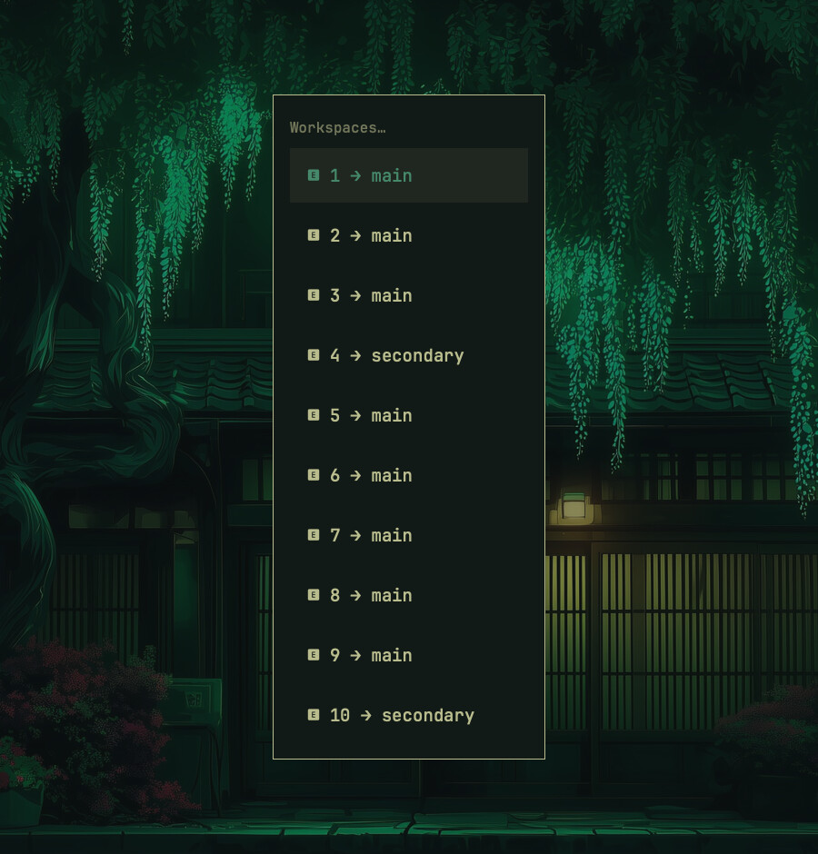</td>
</tr>
<tr>
<td align="center"><sub>Two settings</sub></td>
<td align="center"><sub><b>Gaps</b> — between windows</sub></td>
<td align="center"><sub><b>Workspaces</b> — drill into one…</sub></td>
</tr>
</table>

Drilling into a workspace opens the monitor list *for that workspace*: the
positional keywords AeroSpace understands, plus whatever is connected, by name.
Names survive replugging in a way the keywords do not.

<div align="center">
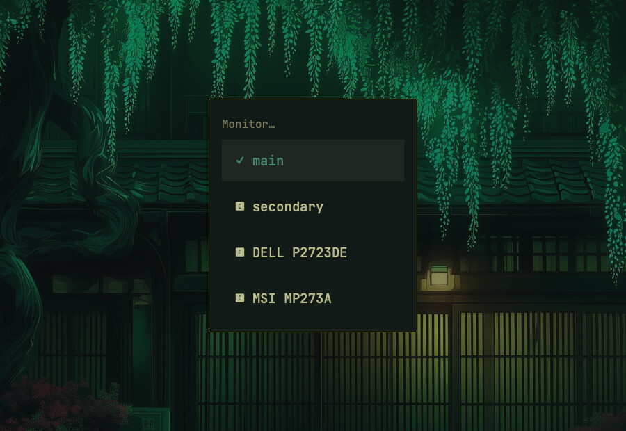
</div>

### Slack

Slack cannot be themed directly, so omamac produces the string and stops there.
**Applications → Slack** copies the sidebar theme for the current theme to your
clipboard; paste it into any Slack message and Slack renders its own *"Switch
sidebar theme"* button. `omamac slack` prints it instead.

<details>
<summary>Why there is no automatic path</summary>

Slack registers no theme deep link (only `slack://app`, `channel`, `doc`, `noop`
and `open`), and its sole local store is an Electron leveldb that is locked while
Slack runs, has no stable external API, and caches an **account-level** setting
that syncs. So even a successful write would likely be overwritten, and a failed
one would corrupt Slack rather than error.

</details>

### Capture

Screenshots and screen recording, sharing one picker — the arrangement upstream
has, where `omarchy-capture-region` serves both so selecting feels the same
whichever you are doing.

<table>
<tr>
<td width="45%">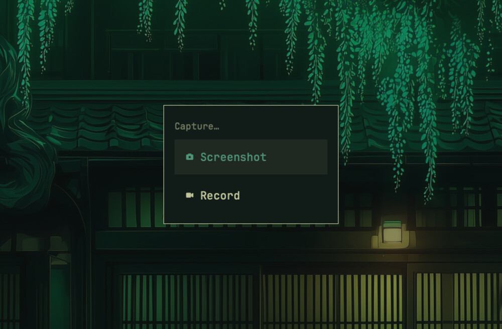</td>
<td width="55%">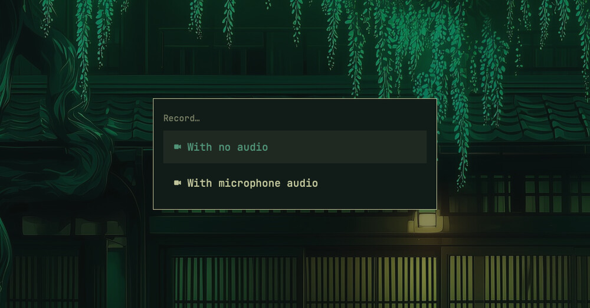</td>
</tr>
<tr>
<td align="center"><sub><b>Capture</b> — a third row, <b>Stop Recording</b>, appears while recording</sub></td>
<td align="center"><sub><b>Record</b> — the other card upstream widens to 520</sub></td>
</tr>
</table>

Picking either freezes the screen and dims it. Drag to select, click to snap to
the window or display under the cursor, <kbd>Esc</kbd> to cancel.

<div align="center">
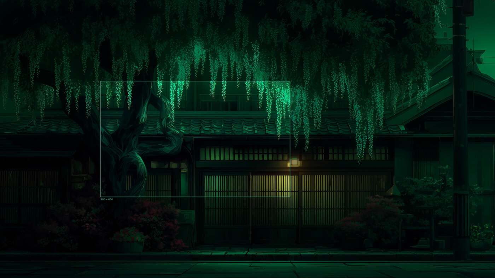
</div>

A screenshot is saved to `~/Pictures` **and** copied to the clipboard. A
recording goes to `~/Movies` and runs until you pick **Stop Recording** — a row
that only exists while something is recording, which is upstream's `when:` on
that entry, answered here by `menu-data`.

**Color** is the third row, Omarchy's own `hyprpicker -a`. The screen freezes
undimmed, a box marks the pixel under the cursor with its hex beside it, and
releasing the mouse copies `#rrggbb` to the clipboard. The colour comes from the
frozen screenshot rather than a fresh sample of the live screen, so the pixel you
clicked and the value you get cannot disagree — verified against a capture's own
decoded PNG bytes.

The freeze is not decoration. A screenshot is taken from the frozen image
rather than the live screen, so what you framed is what you get, and the dim is
torn down before the capture so it never lands in the file. That is upstream's
arrangement exactly: slurp exits before grim runs, leaving hyprpicker's
undimmed freeze standing.

| Variable | Purpose |
| --- | --- |
| `OMAMAC_SCREENSHOT_DIR` | Where screenshots go. Default `~/Pictures`. |
| `OMAMAC_SCREENRECORD_DIR` | Where recordings go. Default `~/Movies`. |

<details>
<summary>What is missing from Omarchy's Capture menu, and why</summary>

- **Desktop audio.** `screencapture` records an *input* device only. Capturing
  system output needs a virtual loopback device (BlackHole, Loopback), so
  offering the row would produce silent recordings on a stock Mac. The
  microphone works and is its own row.
- **Webcam overlay**, which upstream composites with mpv.
- **Text and QR capture**, which need OCR and a QR decoder.

And one divergence: upstream writes `.mp4`. `screencapture` writes a QuickTime
container whatever the extension — verified, major brand `qt  ` — so omamac
writes `.mov` rather than misnaming the file.

Three things worth knowing if you extend this. `screencapture -v` creates
nothing at all until it stops, so "has the file appeared" cannot tell you a
recording started; omamac waits a moment and checks the process is still alive,
since a rejected region exits in about 0.12s. It finalises on **SIGINT**
specifically — anything else kills it mid-write and leaves an unplayable file.

And the colour picker shows no swatch on purpose. An `hs.canvas` fill is painted
through a colour conversion: draw `#3fa7d6` and the pixel that lands on screen
is `#52b4db`, with no declared colour space changing it — hex, explicit
components, `space="sRGB"`, `space="P3"` and `asRGB` all measured identical. A
swatch would show a different colour from the one it reports. Reading is exact;
only drawing shifts. Upstream magnifies instead, which would be both faithful
and colour-correct, but an image element scaled to a whole screen renders empty
inside a full-screen canvas.

</details>

### Deactivate

The last row at the root, and the only one that is not a way in to something.

omamac does exactly two things unprompted: it holds
<kbd>⌘</kbd><kbd>⌥</kbd><kbd>O</kbd> and
<kbd>⌘</kbd><kbd>⌃</kbd><kbd>Space</kbd>, and it re-asserts the wallpaper when
the display configuration changes. **Deactivate** releases both. That is the
whole of "off" — everything else omamac does happens because you asked for it.

```
omamac paused — resume with: omamac resume
```

It changes nothing any tool reads, so your colours stay exactly as they are.
That is deliberate rather than lazy: the pointers that make a theme take effect
— Zed's `"theme": "omamac"`, Claude Code's `custom:omamac`, the Ghostty
`config-file` include, the bat alias, the AeroSpace template — are lines in
*your* config files. omamac does not own them and will not edit them, so
removing the generated themes would leave those aimed at files that no longer
exist.

Since the row releases the hotkey, it also makes this menu unreachable — which
is why the confirmation names the way back, and why `omamac doctor` reports a
paused omamac rather than staying silent about it:

```
  skip  omamac   PAUSED since 2026-09-04T10:23:12 — hotkeys released,
                 wallpaper watcher stopped. Resume with: omamac resume
```

The state is a marker file, not something held in Hammerspoon, so a paused
omamac comes back paused after a reload — and so `omamac resume`, typed in a
terminal, can reach a process it has no other way to talk to (the host watches
the state directory).

## What it themes

| Target | What omamac writes | Takes effect |
| --- | --- | --- |
| **Ghostty** | `~/.config/ghostty/themes/omamac`, `omamac.conf` (colours, font, size, opacity, padding, blur) | live — running terminals reload |
| **Neovim** | `~/.local/state/omamac/current/omamac.lua` | live — pushed to running instances over their sockets |
| **Claude Code** | `~/.claude/themes/omamac.json` | live — Claude Code watches the directory |
| **Zed** | `~/.config/zed/themes/omamac.json` | live — Zed watches the directory |
| **delta** (git's pager) | `~/.config/git/omamac.ini` | next git command |
| **btop** | `~/.config/btop/themes/omamac.theme` | next launch |
| **bat** | `~/.config/bat/themes/omamac.tmTheme` | next launch |
| **AeroSpace** | `~/.config/aerospace/aerospace.toml`, from your template | live — `reload-config` |
| **macOS appearance** | light/dark system setting, from the theme's `mode` | live |
| **Wallpaper** | per-Space desktop picture, from the theme's backgrounds | live |

A target that isn't installed is a warning, not a failure. The only hard failure
is a theme that can't be resolved at all.

### The themes

All 22 are vendored from Omarchy v4.0.2:

`catppuccin` · `catppuccin-latte` · `ethereal` · `everforest` · `flexoki-light` ·
`gruvbox` · `hackerman` · `kanagawa` · `last-horizon` · `lumon` · `lupine` ·
`matte-black` · `miasma` · `nord` · `osaka-jade` · `retro-82` · `ristretto` ·
`rose-pine` · `solitude` · `tokyo-night` · `vantablack` · `white`

## Requirements

- **macOS.** `sips`, `osascript`, `defaults` and `plutil` are used directly.
- **[Hammerspoon](https://www.hammerspoon.org)** for the menu, with Accessibility
  permission granted. The CLI works without it.
- `bash`, `jq`, `curl` — `sips` and the rest ship with macOS.
- Optionally the tools in the table above. None are required for omamac to run.

Backgrounds and theme previews are downloaded from Omarchy on demand and cached
under `~/.cache/omamac`, so the first open of a picker needs network.

## Install

### Homebrew

```bash
git clone https://github.com/pedroagribeiro/omamac.git ~/personal/omamac
cd ~/personal/omamac
./install
```

That installs `jq` and Hammerspoon, symlinks `bin/omamac` into `~/.local/bin`,
and writes `~/.hammerspoon/init.lua` — unless you already have one, in which case
it prints the single line to add by hand rather than overwriting your config.

Then launch Hammerspoon, grant it Accessibility permission when macOS prompts
(System Settings → Privacy & Security → Accessibility), and press
<kbd>⌘</kbd><kbd>⌥</kbd><kbd>O</kbd>.

### Nix flake

<details>
<summary>Input, package, and the one thing that will trip you up</summary>

Add the input:

```nix
inputs.omamac.url = "github:pedroagribeiro/omamac";
```

`packages.default` puts `omamac` on `PATH`, wrapped with the tools it needs. The
Hammerspoon host has to be loaded from `~/.hammerspoon/init.lua`, and the path
must be written in **literally** — a GUI app launched through LaunchServices
inherits no shell environment, so `home.sessionVariables` and `.zshrc` exports
are both invisible to `Hammerspoon.app`:

```nix
home.file.".hammerspoon/init.lua".text = ''
  OMAMAC_DIR = "${inputs.omamac.packages.${pkgs.system}.default}/share/omamac"
  OMAMAC_BIN = "${inputs.omamac.packages.${pkgs.system}.default}/bin/omamac"
  dofile(OMAMAC_DIR .. "/hammerspoon/omamac.lua")
'';
```

`OMAMAC_BIN` should point at the **wrapped** binary in `bin/`, not the copy under
`share/omamac/bin/` — only the wrapper has `jq`/`curl` on `PATH`.

Install Hammerspoon yourself (`brew install --cask hammerspoon`); the flake
packages no cask. And back up any existing `~/.hammerspoon/init.lua` first —
`home.file` overwrites it unconditionally.

</details>

## Wiring individual tools

Most targets are written straight into files those tools already read, so they
need nothing further. A few need one line each, because omamac writes to a file
that has to be explicitly included.

<details>
<summary><b>Ghostty</b> — one include, and it must be last</summary>

The **last** line of `~/.config/ghostty/config`, after any other `config-file`
includes, since later values win:

```
config-file = ?omamac.conf
```

</details>

<details>
<summary><b>delta</b> — one include, and it must be last</summary>

The **last** include in your git config, after your own `[delta]` section so
these values win — notably `light`, which omamac drives from the theme:

```ini
[include]
  path = ~/.config/git/omamac.ini
```

</details>

<details>
<summary><b>Zed</b> — theme only, not the font</summary>

In `~/.config/zed/settings.json`:

```json
{ "theme": "omamac" }
```

The generated theme declares its own `appearance`, following the active theme, so
there is no light/dark pair to switch between — use the plain string form rather
than `{"mode": "system", …}`.

omamac drives Zed's **colours only**, not its font. Fonts are settings rather
than theme (Zed's theme schema has no font fields), and Zed has no include
mechanism like Ghostty's `config-file`, so the only place to write one is
`settings.json` itself. Where that file is version-controlled, writing it on
every font change means generated values landing in git — which is why omamac
leaves it alone. Set `buffer_font_family` yourself to match.

</details>

<details>
<summary><b>Claude Code</b></summary>

In `~/.claude/settings.json`:

```json
{ "theme": "custom:omamac" }
```

</details>

<details>
<summary><b>bat</b> — and build the cache, or it cannot see the theme</summary>

```bash
alias cat='bat -p --theme=omamac'
bat cache --build
```

bat only uses themes it has compiled into its cache, so a perfectly correct
`.tmTheme` is invisible until you build it once.

</details>

<details>
<summary><b>Neovim</b> — load the colorscheme, and expose a socket for live switches</summary>

In your `init.lua`:

```lua
-- Load omamac's generated colorscheme, and expose a socket so a theme
-- switch can push the new one into this instance live.
local omamac_theme = os.getenv("HOME") .. "/.local/state/omamac/current/omamac.lua"
if vim.uv.fs_stat(omamac_theme) then pcall(dofile, omamac_theme) end
local sockdir = os.getenv("HOME") .. "/.cache/nvim/servers"
vim.fn.mkdir(sockdir, "p")
pcall(vim.fn.serverstart, sockdir .. "/" .. vim.fn.getpid() .. ".sock")
```

If something like [vim-lumen](https://github.com/vimpostor/vim-lumen) also
watches the macOS appearance and switches colorscheme on its own, point its
light/dark callbacks at omamac's generated file too — otherwise it will clobber
omamac's colours on every light↔dark flip. Its job is to signal *when* the
appearance changes, never to decide *what* to apply:

```lua
vim.api.nvim_create_autocmd("User", { pattern = "LumenLight", callback = load_omamac })
vim.api.nvim_create_autocmd("User", { pattern = "LumenDark",  callback = load_omamac })
```

</details>

<details>
<summary><b>AeroSpace</b> — a template, because the config is yours</summary>

AeroSpace can only change gaps by editing its config — its CLI is read-only and
there is no include mechanism — and that config is usually version-controlled,
where generated values do not belong. So omamac renders it.

Link your config as `~/.config/aerospace/aerospace.template.toml` and mark the
values omamac owns:

```toml
[gaps]
  inner.horizontal = 10  # omamac:gaps
  outer.top =        10  # omamac:gaps

[workspace-to-monitor-force-assignment]
1 = 'main'       # omamac:workspace
4 = 'secondary'  # omamac:workspace
```

omamac writes `aerospace.toml` beside the template, substituting only the marked
values. The template holds **real defaults rather than placeholders**, so it
stays a complete, valid AeroSpace config on its own — nothing breaks if omamac
never runs. `omamac aerospace --render` rebuilds it, which is worth running on
activation so template edits take effect.

</details>

## Usage

| Key | Action |
| --- | --- |
| <kbd>⌘</kbd><kbd>⌥</kbd><kbd>O</kbd> | Open the menu |
| <kbd>⌘</kbd><kbd>⌃</kbd><kbd>Space</kbd> | Next wallpaper in the current theme |

> **Why <kbd>⌘</kbd><kbd>⌥</kbd><kbd>O</kbd> and not <kbd>⌘</kbd><kbd>⌥</kbd><kbd>Space</kbd>?**
> macOS reserves ⌥⌘Space for "Show Finder search window". Disabling that
> preference does not release the running registration without a re-login, so
> Hammerspoon's bind fails with `RegisterEventHotKey failed: -9878`. Change the
> `hs.hotkey.bind` line in `hammerspoon/omamac.lua` if you'd rather have the
> Omarchy-faithful chord and don't mind logging out.

### CLI

Everything the menu does, it does by calling this.

```
omamac theme      [name|--list|--current]
omamac font       [name|--list|--current]
omamac font-size  [points|--list|--current]
omamac opacity    [percent|--list|--current]
omamac padding    [points|--list|--current]
omamac blur       [radius|--list|--current]
omamac bg         [name|--next|--reapply|--list|--current]
omamac aerospace  [gaps|--workspace <n>=<monitor>|--workspaces|--monitors|--render|--list|--current]
omamac pause      [--status|--since]
omamac resume
omamac capture    --screenshot|--record [--region "X,Y WxH"] [--audio]
                  --color "#rrggbb" | --stop | --status
omamac slack      [--copy]
omamac doctor
omamac menu-data
omamac preview    <wallpaper>|--theme <name>|--paths [--theme]
```

`omamac bg` takes a wallpaper's **basename**, the way `--list` prints them;
`--current` answers with the full path.

`menu-data` and `preview` are what the Hammerspoon host calls; you won't
normally run them by hand.

To widen the font list past Nerd Fonts:

```bash
OMAMAC_FONT_FILTER='.' omamac font --list          # everything available
```

## omamac doctor

```bash
omamac doctor
```

Checks that every target actually reflects the current theme, and exits non-zero
if any doesn't. It's **read-only**: it never re-renders and never repairs,
because drift is the finding and a diagnostic that fixes what it inspects can
never tell you something was wrong. Most failures clear with:

```bash
omamac theme "$(omamac theme --current)"
```

It deliberately asks more than "does the file exist". Each check asks whether the
artefact carries the *current* theme's colours, whether the pointer that makes it
take effect is in place, and whether the consuming tool can really see it — bat,
for instance, only uses themes it has compiled into its cache, so a perfectly
correct `.tmTheme` can be invisible; and delta's values only win if the
`[include]` is ordered after your own `[delta]` block, so that check resolves
through your real git config rather than reading the generated file.

## Configuration

| Variable | Purpose |
| --- | --- |
| `OMAMAC_FONT_FILTER` | Case-insensitive ERE for which font families the picker offers. Default matches Nerd Fonts. |
| `OMAMAC_OMARCHY_REV` | Upstream tag backgrounds and previews are fetched from. Default `v4.0.2`. |
| `OMAMAC_CONFIG_ROOT` | Where per-tool configs are written. Default `~/.config`. |
| `OMAMAC_CLAUDE_DIR` / `CLAUDE_CONFIG_DIR` | Claude Code's config directory. Default `~/.claude`. |
| `OMAMAC_STATE` / `OMAMAC_CACHE` | State and cache roots. Default `~/.local/state/omamac`, `~/.cache/omamac`. |
| `OMAMAC_THEMES_DIR` | Where themes are read from. Default the checkout's `themes/`. |
| `OMAMAC_SCREENSHOT_DIR` / `OMAMAC_SCREENRECORD_DIR` | Where captures go. Default `~/Pictures`, `~/Movies`. |
| `OMAMAC_DIR` | Install root. Resolved automatically; see below. |

The remaining `OMAMAC_*` variables (`OMAMAC_PS`, `OMAMAC_KILL`,
`OMAMAC_OSASCRIPT`, `OMAMAC_SIPS`, `OMAMAC_FETCH`, `OMAMAC_BAT`, `OMAMAC_GIT`,
`OMAMAC_DEFAULTS`, `OMAMAC_GHOSTTY`, `OMAMAC_NVIM`, `OMAMAC_FCLIST`) exist so the
test suite can substitute stubs for anything that would touch the real machine.
They work at runtime too, but that's not what they're for.

<details>
<summary><code>OMAMAC_DIR</code> — how each script finds its siblings</summary>

Every `omamac-*` script finds its siblings through `OMAMAC_DIR`. The dispatcher
sets it from its own resolved location if unset, so running from a checkout or
from a Nix store path both work unconfigured. The Hammerspoon host can't use the
environment at all (GUI apps inherit no shell), so it resolves, in order: a
global `OMAMAC_DIR` Lua variable written into `init.lua`, then the environment
variable, then `~/personal/omamac`.

</details>

## How it works

```
bin/omamac              dispatcher; every verb is bin/omamac-<verb>
lib/                    colours (Omarchy's schema + mix), state, fetch, logging
render/                 one script per target, all driven from colors.toml
themes/<name>/          vendored colors.toml + backgrounds.index
menu/menu.html          the menu, rendered in a WKWebView
hammerspoon/omamac.lua  hotkeys, the webview host, message plumbing
hammerspoon/region.lua  the region picker, upstream's omarchy-capture-region
```

A theme switch renders Ghostty first and reloads it immediately — it's the thing
you're looking at — then runs the remaining renderers concurrently.

**Themes are vendored, backgrounds are not.** Each theme directory holds the
`colors.toml` and an index of its background filenames; the images and preview
screenshots are fetched on demand from a pinned upstream tag and cached. Re-vendor
with `tools/sync-themes`.

**Colour resolution is its own layer** (`lib/colors.sh`). Omarchy's `master`
branch uses a legacy `color0`–`color15` palette while the v4 release tags use
named colours (`red`, `bright_blue`, …) plus an explicit `mode`. Renderers ask for
whichever they want and an alias chain resolves it, so both schemas work and a
missing key degrades loudly instead of emitting an empty value.

**The wallpaper is re-asserted when displays change.** macOS keeps a wallpaper per
Space, and connecting or disconnecting a monitor makes it restore its *own*
remembered picture for each Space — which silently reverted the desktop to a
previous theme's while every other target stayed current. A screen watcher calls
`bg --reapply`, a no-op when nothing has drifted.

<details>
<summary>Adding a target</summary>

1. Write `render/<tool>`, taking a theme directory and wherever it should write.
   Use `omamac_hex_or_warn` for colours and `omamac_is_light` for light/dark.
   Rename generated files into place rather than writing in situ if anything
   might read them concurrently.
2. Add it to the concurrent block in `bin/omamac-theme`, with its own
   `wait`/`log_warn` pair so its failure is reported as its own.
3. Add checks to `bin/omamac-doctor` — including whether the pointer that makes
   it take effect is present.
4. Add `tests/render_<tool>_test.sh`, and a test in `tests/theme_test.sh`
   asserting a real theme switch writes it.

</details>

<details>
<summary>Adding an application to the menu</summary>

An entry in that level's `items`, plus either `into` (it has settings of its own)
or `runs` (a single action), and a glyph in `APP_ICONS` — all in
`menu/menu.html`.

</details>

## Development

```bash
./tests/run
```

371 tests, plain bash — no framework — needing `node`, a Lua front-end, `jq` and
macOS's `plutil`. There's deliberately no flake `checks` output: none of those
exist in a Nix sandbox, and a check that can never pass is worse than none.

Tests here are expected to be **mutation-checked**: break the thing on purpose
and confirm a test fails. This codebase has produced a long line of tests that
passed for the wrong reason — presence assertions that couldn't detect a swap, a
harness whose exit gate was swallowed by a subshell, a colour comparison that
couldn't see a reversed interpolation. If a test didn't fail against a deliberate
break, it isn't testing anything.

And a green suite is not evidence the menu works. Every serious defect in this
project survived a passing suite and was only found by measuring the live app: an
`hs.task` pipe deadlock; `hs.task` silently delivering zero stdout for 15–19 of 22
concurrent children, exit 0, no stderr; rows squashed to 25px by a flex default.
Open the page in a webview and read back computed styles, or screenshot it.

## Credits

Themes, colour schema, menu geometry, picker behaviour and thumbnail recipe all
come from [Omarchy](https://github.com/omacom/omarchy) by David Heinemeier Hansson
and contributors, MIT licensed. omamac vendors each theme's `colors.toml` and
fetches its backgrounds from a pinned release tag. It is not affiliated with or
endorsed by the Omarchy project.

omamac itself is MIT licensed — see [LICENSE](LICENSE).
